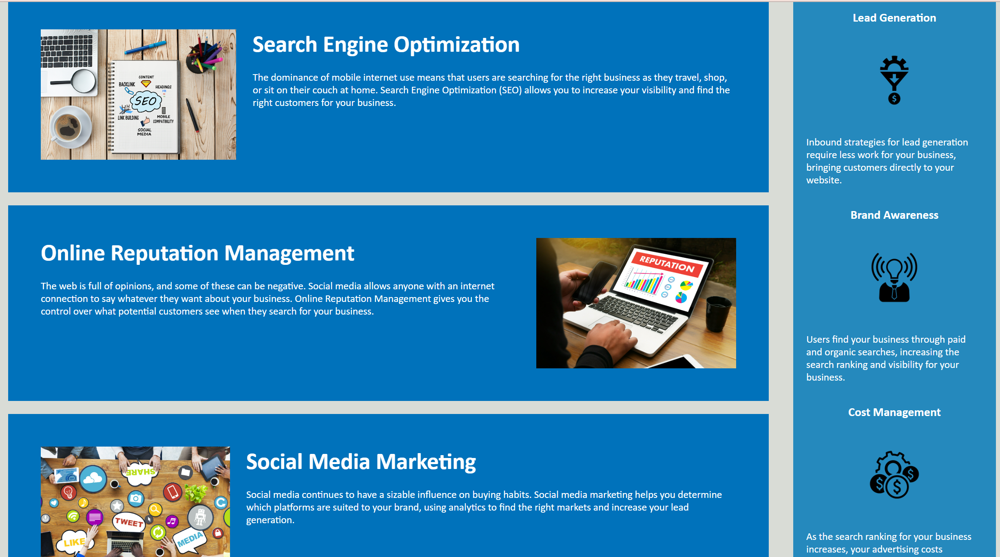

# Horiseon Code Refractor

I have been tasked with modifying the starter code for Horiseon marketing agency website to make it more accessible for their users. Making the website more accessible for the end user will enable people with disabilities to access the website using a variety of assisitve technologies. This will also ensure that the site is optimized for search engines.

To complete this I will be
* Ensuring that Semantic HTML elements can be found throughout the source code
* Checking that the HTML elements follow a logical structure
* Providing all image and icon elements with accessible `alt` attributes
* Ensuring that all heading attributes fall in sequential order
* Ensuring title elements are concise and descriptive 

## Installation

To open the project please follow this link: 

## Usage 

Once you open the URL, you will see the following:

By clicking on the buttons in the top right, you can navigate to the sections within the page. 
It will look like this: 

## Badges

## Features

- Alt text for all images and icons to increase accessibility.

## Credits

I would like to refrence the following website I used to guide me with the semantic attribute element of this project:
https://www.w3schools.com/html/html5_semantic_elements.asp

## License

MIT License

Copyright (c) [2023] [Anastasia Moraites]

Permission is hereby granted, free of charge, to any person obtaining a copy
of this software and associated documentation files (the "Software"), to deal
in the Software without restriction, including without limitation the rights
to use, copy, modify, merge, publish, distribute, sublicense, and/or sell
copies of the Software, and to permit persons to whom the Software is
furnished to do so, subject to the following conditions:

The above copyright notice and this permission notice shall be included in all
copies or substantial portions of the Software.

THE SOFTWARE IS PROVIDED "AS IS", WITHOUT WARRANTY OF ANY KIND, EXPRESS OR
IMPLIED, INCLUDING BUT NOT LIMITED TO THE WARRANTIES OF MERCHANTABILITY,
FITNESS FOR A PARTICULAR PURPOSE AND NONINFRINGEMENT. IN NO EVENT SHALL THE
AUTHORS OR COPYRIGHT HOLDERS BE LIABLE FOR ANY CLAIM, DAMAGES OR OTHER
LIABILITY, WHETHER IN AN ACTION OF CONTRACT, TORT OR OTHERWISE, ARISING FROM,
OUT OF OR IN CONNECTION WITH THE SOFTWARE OR THE USE OR OTHER DEALINGS IN THE
SOFTWARE.